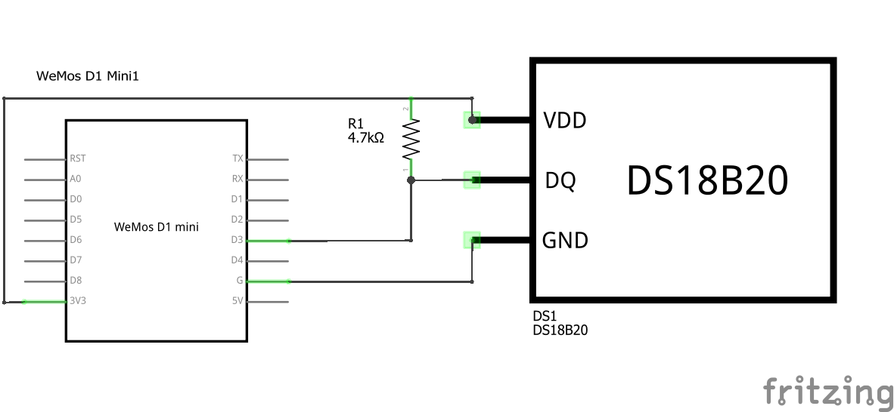

# Lab Exercise - ESP8266 and DS18B20 Temperature Sensor

This lab will introduce students to sensors and serial communication, using a DS18B20 temperature sensor.

### DS18B20 Temperature Sensor

The DS18B20 digital thermometer provides 9-bit to 12-bit Celsius temperature measurements in the range -55°C to +125°C. Communication with the DS18B20 uses a 1-wire serial protocol. Multiple devices can share the same 1-wire bus as each device has a unique 64-bit serial code. The DS18B20 can be powered by a supply between 3.0V and 5.5V.

## Exercise 1

First, we will build and test a circuit using the temperature sensor.

#### Components Needed
* DS18B20 temperature sensor
* 4k7 resistor
* connecting wires
* esp8266 development board (e.g. Wemos D1 mini)

### Instructions

1. Wire up the components as shown in the diagrams. The data line (DQ) needs to be pulled high using a 4k7 ohm resistor.
   
   
    
   

   ### Default Pin Wiring

    | Pin No | Function | Device Connection |
    | --- | --- | --- |
    | 3V3 | +3.3V | Vdd |
    | G | GND | GND |
    | D3 | GPIO 0 | DQ |

   

2. Make sure the temperature sensor is wired the correct way round!

3. - If using Arduino IDE, open the [ds18b20-simple](arduino/ds18b20-simple/ds18b20-simple.ino) sketch and run it.

   - If using micropython (i.e. with Thonny), upload the micropython/lib folder and run the [temp_readings.py](micropython/temp_readings.py) script.

4. Open the serial monitor / REPL and check that the sensor is working correctly.

Q1. What cable carries the data?

Q2. What libraries are needed to run this sketch?

Q3. What are libraries (in this context)? How are they helpful?

## Exercise 2

This exercise will add a trigger condition based on temperature.

### Instructions

1. Expand the previous circuit by adding an LED.

2. Write a program, that when the temperature goes above 24°C, the LED turns on. If the temperature is below 24°C the LED is off.

### Additional Exercise

1. Add several LEDs in a row to your circuit.

2. Write a program so that the LEDs turn on succession as the temperature increases.

